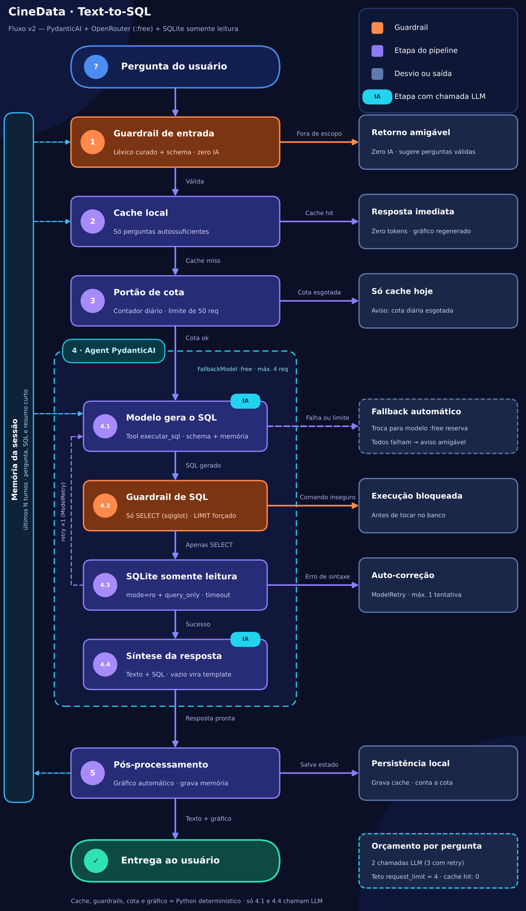
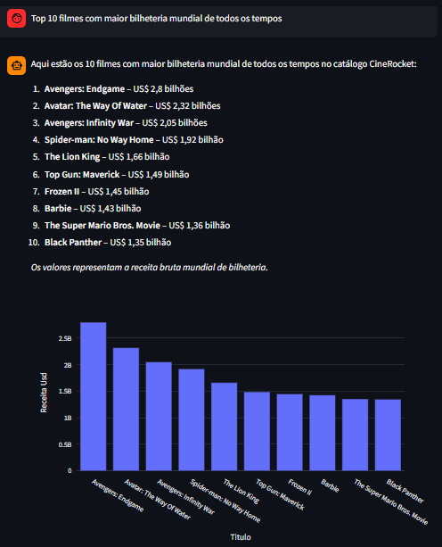
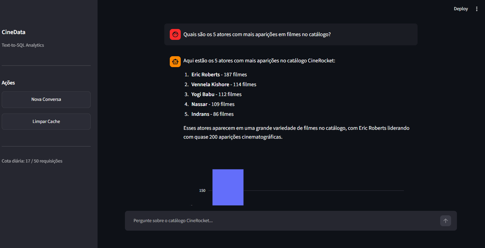

<div align="center">

# CineData Analytics 🎬

### Agente Text-to-SQL com Defesa em Profundidade e Otimização Orçamentária

<p align="center">
  
  
  
  
</p>
<p align="center">
  
  
  
  
  
</p>

<p align="center">
  <i>Pipeline Text-to-SQL determinístico com 6 nós defensivos, cache léxico a custo zero e interface reativa para consultas analíticas sobre o catálogo CineRocket.</i>
</p>

---

</div>

O **CineData Analytics** é um agente analítico autônomo baseado no padrão **Text-to-SQL**, projetado para traduzir perguntas complexas de negócio em consultas precisas e seguras sobre o banco relacional do catálogo **CineRocket**.

O sistema alia um pipeline determinístico de **6 nós defensivos** a uma interface conversacional minimalista no Streamlit, garantindo conformidade estrita com princípios de segurança, controle orçamentário rigoroso (custo zero em requisições repetidas) e geração automática de visualizações interativas via Plotly.

---

## 1. Demonstração Visual

A arquitetura e os resultados analíticos do CineData Analytics são ilustrados pelos artefatos a seguir:

### 1.1. Arquitetura dos Nós do Pipeline Analítico
O ciclo de vida de cada requisição atravessa 6 nós desacoplados e resilientes:



---

### 1.2. Interface Analítica com Visualização Dinâmica
Exemplo de processamento analítico com resposta em linguagem natural, extração dos metadados e renderização determinística de gráfico Plotly no Streamlit:



---

### 1.3. Conversação Multi-Turn e Resolução de Contexto
Demonstração da janela de memória deslizante resolvendo anáforas e permitindo a inspeção sob demanda da consulta SQL gerada:



---

## 2. Registro de Decisões Arquiteturais (ADRs)

### ADR 01: Transição de Framework — LangGraph vs. PydanticAI

Durante as fases iniciais de prototipação, considerou-se o uso de orquestradores baseados em grafo como o **LangGraph**. Contudo, a experiência prática revelou gargalos de manutenção e complexidade acidental que motivaram a migração integral para o **PydanticAI**.

#### Motivos do Descarte do LangGraph
- **Complexidade Acidental e Boilerplate**: A modelagem de grafos com nós, arestas condicionais e canais de estado adicionava centenas de linhas de código ritualístico para fluxos analíticos essencialmente lineares e síncronos.
- **Tipagem Fraca em Estado Dinâmico**: O estado compartilhado no LangGraph costuma depender de dicionários (`TypedDict` com anotações de redução), onde validações de campos aninhados em tempo de execução falham silenciosamente ou exigem parsers manuais.
- **Injeção de Dependências Onerosa**: Passar conexões de banco de dados, serviços de cache e métricas de cota através de nós de grafo exige empacotamento em configurações de execução globais, dificultando testes unitários isolados com mocks.

#### Benefícios Adotados com o PydanticAI
- **Validação Estrita com Pydantic v2**: Contratos de entrada e saída (`RespostaAgente`, `ResultadoPipeline`, `TurnoMemoria`) são garantidos em nível de bytecode, rejeitando tipos incongruentes antes de atingirem o cliente.
- **Injeção de Dependências Tipadas (`RunContext`)**: O `ContextoAgente` é injetado diretamente na ferramenta `@agente.tool`, permitindo que `executar_sql` acesse a conexão do banco de dados e registre os dados tabulares brutos sem poluir o contexto de tokens do LLM.
- **Ferramentas como Funções Python Puras**: A ferramenta de execução SQL é uma função convencional com assinatura tipada e docstring clara, permitindo execução direta em testes unitários sem levantar runners de grafo.
- **Suporte Nativo a Fallback (`FallbackModel`)**: Implementação elegante de cascata de contingência de múltiplos modelos sem dependência de lógica externa.

| Critério | LangGraph | PydanticAI (Adotado) |
| :--- | :--- | :--- |
| **Paradigma de Tipagem** | Dicionários anotados / Redutores | Modelos Pydantic estritos em tempo de execução |
| **Injeção de Dependências** | Contexto global de execução | `RunContext[ContextoAgente]` tipado por chamada |
| **Declaração de Tools** | Wrappers decorados sobre esquemas LangChain | Funções Python nativas (`@agente.tool`) |
| **Fallback de Modelos** | Roteamento manual em nós de exceção | `FallbackModel` nativo e transparente |
| **Manutenibilidade** | Média/Baixa (boilerplate elevado) | Alta (código idiomático Python) |

---

### ADR 02: Estratégia de Provedores e Mitigação de Rate Limit (HTTP 429)

A operação em produção foi desenhada para utilizar o ecossistema de modelos abertos gratuitos via **OpenRouter**, o que impôs desafios técnicos de latência, disponibilidade e quotas severas de requisições.

#### Cascata de Modelos com Fallback
A lista de modelos foi validada empiricamente para suporte a *Tool Calling* no SQLite, configurada em cascata decrescente de capacidade e janela de contexto:
1. `qwen/qwen3.8-27b:free` (Primário - 262k tokens, excelente aderência sintática a SQL)
2. `cohere/north-mini-code:free` (Secundário - 256k tokens, especializado em código)
3. `nvidia/nemotron-3-super-120b-a12b:free` (Terciário - 262k tokens, alta capacidade de raciocínio)
4. `nvidia/nemotron-3.5-lightning:free` (Quaternário - 1M tokens, recuperação rápida)

Se o modelo primário retornar erro de sobrecarga, indisponibilidade ou falha de rede, o `FallbackModel` do PydanticAI delega a chamada imediatamente ao próximo candidato sem abortar a operação do usuário.

#### A Dinâmica Real de Requisições e Gestão da Cota
Uma constatação crítica de engenharia obtida na depuração é que **1 pergunta analítica do usuário não equivale a 1 requisição HTTP**:
- **Passo 1 (Tool Call)**: O agente envia o prompt de sistema e a pergunta ao modelo, recebendo como instrução a chamada da ferramenta `executar_sql` (1 requisição HTTP consumida).
- **Passo 2 (Execução Local)**: A ferramenta roda no SQLite e retorna uma amostra de 15 linhas ao contexto.
- **Passo 3 (Síntese Analítica)**: O agente submete a amostra de volta ao modelo para formulação da resposta em português (1 requisição HTTP consumida).
- **Casos com Auto-Correção**: Se a primeira query apresentar erro de sintaxe, o mecanismo de `ModelRetry` realiza mais 1 passo de correção, consumindo até 3 a 4 requisições por turno.

Como as contas gratuitas do OpenRouter limitam o uso a **50 requisições diárias**, o `PipelineCineData` sincroniza o consumo real extraindo o valor exato de chamadas do objeto de métricas (`usage.requests` ou atributo `qtd_requests`).

#### Tratamento Robusto de HTTP 429
Quando o provedor atinge o teto da conta, o erro pode se manifestar como um `RateLimitError` direto ou encapsulado em um `FallbackExceptionGroup` (quando todos os modelos da cascata falham por exaustão de quota). 

O pipeline inspeciona a árvore de exceções recursivamente:
- Ao identificar qualquer código `429` ou mensagem de *rate limit*, aciona `gerenciador_cota.forcar_esgotamento()`, travando o contador local no teto (50/50).
- Exibe de forma amigável o horário exato de renovação da cota (21:00 BRT / 00:00 UTC), impedindo novas chamadas externas infrutíferas.

---

### ADR 03: Defesa em Profundidade — Camadas de Guardrails

A segurança e previsibilidade do CineData baseiam-se em uma arquitetura de defesa multicamada:

```
[Entrada Bruta]
       │
       ▼
┌────────────────────────────────────────────────────────┐
│ Nó 1: Input Guard (Regex + Sanitização + Teto 500c)    │ ──► [Rejeição Custo Zero]
└────────────────────────────────────────────────────────┘
       │ Válido
       ▼
┌────────────────────────────────────────────────────────┐
│ Nó 2: Cache Semântico Local (Hash SHA-256 em JSON)     │ ──► [Hit: Retorno Imediato Custo Zero]
└────────────────────────────────────────────────────────┘
       │ Miss
       ▼
┌────────────────────────────────────────────────────────┐
│ Nó 3: Verificação de Cota Diária (Trava local em disco)│ ──► [Bloqueio Preventivo]
└────────────────────────────────────────────────────────┘
       │ Saldo Disponível
       ▼
┌────────────────────────────────────────────────────────┐
│ Nó 4: Agente Text-to-SQL (PydanticAI + Prompt Defensivo)
│       └─► Nó 4.2: SQL Guard (AST SQLGlot - Read-Only)  │ ──► [ModelRetry se Mutação/Multi-query]
└────────────────────────────────────────────────────────┘
       │ Consulta Executada com Sucesso
       ▼
┌────────────────────────────────────────────────────────┐
│ Nó 5: Visualização Determinística (Plotly)             │ ──► [Gráfico ou Formato Escalar]
└────────────────────────────────────────────────────────┘
       │
       ▼
┌────────────────────────────────────────────────────────┐
│ Nó 6: Pós-processamento (Persistência no Cache + Memória)
└────────────────────────────────────────────────────────┘
```

#### Nó 1 — Input Guard (`src/guardrails/input_guard.py`)
- **Custo Zero de Tokens**: Validação preliminar executada antes de qualquer chamada a provedores de IA.
- **Sanitização de Caracteres**: Remoção de caracteres de controle ASCII invisíveis (`\x00-\x1F`) e colapso de espaços repetidos.
- **Proteção contra Injeção de Prompt**: Expressões regulares compiladas barram tentativas de jailbreak, subversão de personas (*developer mode*, *terminal bash*) e comandos destrutivos diretos.
- **Teto de 500 Caracteres**: Previne estouros de buffer, ataques de negação de serviço (DoS) por excesso de contexto e custos inflacionados de inferência.

#### Nó 2 — Cache Semântico Local (`src/services/cache.py`)
- **JSON Atômico em Disco vs. Redis / Bancos Vetoriais**: 
  - Elimina a necessidade de subir containers Docker (Redis/PostgreSQL/Qdrant) para uso local ou testes.
  - Gravação atômica via arquivo temporário (`.tmp` seguido de `os.replace`), garantindo integridade contra encerramentos abruptos da aplicação.
  - Caches vetoriais exigem modelos de embeddings (gerando custo financeiro ou overhead de CPU/memória para modelos locais) mesmo quando a base de perguntas ainda é fria.
- **Normalização Léxica e Hash SHA-256**: A chave do cache é calculada após conversão para minúsculas, remoção de espaçamentos redundantes e exclusão de pontuações periféricas (`?`, `!`, `.`, `,`). Dessa forma, perguntas idênticas com pontuação distinta têm resolução idêntica e instantânea com custo zero.

#### Nó 3 — Memória Conversacional (`src/services/memory.py`)
- **Janela Deslizante de 3 Turnos**: Preserva exclusivamente os últimos turnos no histórico injetado no prompt de sistema.
- **Resumo Determinístico Conciso**: Cada turno registra a pergunta, o comando SQL executado e um resumo de até 150 caracteres da resposta.
- **Resolução Nativa de Anáforas**: A LLM resolve referências contextuais (ex.: *"E qual foi o orçamento dele?"* referindo-se ao filme citado no turno anterior) diretamente no passo de inferência, descartando agentes secundários caros de reescrita de prompt.

#### Nó 4 — Agente Text-to-SQL e Configuração (`src/agent/text_to_sql.py`, `src/config.py`)
- **Teto Operacional de Segurança (`request_limit=8`)**: Concede ciclos suficientes para joins analíticos entre as tabelas do catálogo (`dim_movies`, `dim_genres`, `dim_people`, `fact_movie_box_office`, etc.) e auto-correções eventuais sem permitir loops infinitos.
- **System Prompt Defensivo**: Instruções mandatórias para SQLite:
  - Uso estrito de `LIKE` ou `LOWER()` em substituição ao `ILIKE`.
  - Tratamento preventivo de divisão por zero com `NULLIF(divisor, 0)` em métricas de ROI e margem.
  - Extração temporal via `strftime('%Y', data)`.
  - Limite padrão razoável de linhas nas consultas analíticas.

#### Nó 4.2 — SQL Guard via SQLGlot (`src/guardrails/sql_guard.py`)
- **Rejeição de Validação por Regex**: Expressões regulares são historicamente vulneráveis a contornos com comentários SQL (`/* ... */`), quebras de linha ou caracteres de escape.
- **Inspeção via Árvore Sintática Abstrata (AST)**: O SQLGlot analisa gramaticalmente a consulta sob o dialeto SQLite:
  - A raiz deve ser estritamente uma instância de `exp.Select` ou `exp.Union`.
  - Varredura profunda contra nós proibidos: `exp.Insert`, `exp.Update`, `exp.Delete`, `exp.Drop`, `exp.Alter`, `exp.Create`, `exp.Pragma`, `exp.Command`.
  - Bloqueio explícito de cláusula `INTO` (`SELECT ... INTO`).
  - Bloqueio rigoroso de *multi-statements* (múltiplas consultas delimitadas por `;`).

---

### ADR 04: Resiliência do Frontend em Streamlit (`app.py`)

Integrar um agente assíncrono com ciclo de vida baseado em PydanticAI à arquitetura reativa do Streamlit impôs soluções específicas de engenharia:

#### Padrão `AsyncRunner`
- **Problema**: O Streamlit executa cada interação do usuário reexecutando todo o script em threads de curta duração. O uso direto de `asyncio.run()` fecha o event loop ao término da corrotina, disparando exceções de `RuntimeError: Event loop is closed` em chamadas subsequentes das bibliotecas assíncronas (HTTPX / PydanticAI).
- **Solução**: Uma classe utilitária `AsyncRunner` inicializa um `asyncio.new_event_loop()` em uma thread `daemon` persistente (`threading.Thread`). As tarefas assíncronas são despachadas via `asyncio.run_coroutine_threadsafe()`, garantindo que o loop de eventos permaneça sempre ativo durante toda a vida da sessão.

#### Ciclo de Execução em Duas Fases
- **Problema**: Se o usuário enviar múltiplos inputs ou clicar em botões de sugestão enquanto uma query pesada está sendo executada, o Streamlit pode interromper a thread ativa, deixando estados órfãos no session state.
- **Solução**:
  - **Fase 1 (Agendamento)**: Ao receber a pergunta, o sistema apenas registra a mensagem no histórico, armazena o texto em `st.session_state.pergunta_pendente` e aciona `st.rerun()`.
  - **Fase 2 (Processamento Seguro)**: No ciclo seguinte, a UI renderiza com `st.chat_input(disabled=True)`. A chamada do pipeline ocorre dentro de um bloco `try / except / finally`, garantindo que `pergunta_pendente` seja limpo e que novo `st.rerun()` libere o campo de input somente após a conclusão.

#### Identificadores Únicos de Componentes
- Todos os gráficos Plotly no histórico utilizam chaves explicitamente indexadas (`key=f"grafico_{idx}"`), eliminando colisões de `StreamlitDuplicateElementId` à medida que a conversa se estende.

#### Design Minimalista e Limpo
- A interface segue uma estética minimalista, priorizando tipografia limpa, hierarquia visual, espaçamento refinado e ausência de emojis estruturais.

---

## 3. Mapeamento e Estrutura de Diretórios

A estrutura do projeto é organizada de forma modular, separando serviços, agentes, guardrails e testes:

```
cinerocket-agent/
│
├── .cache/                     # Persistência local em disco (cache de queries e cota diária)
│   ├── cache_perguntas.json   # Histórico de respostas em cache com hash SHA-256
│   ├── cota.json              # Contador atômico diário de requisições HTTP
│   └── db_schema.txt          # Cache do DDL inspecionado do banco SQLite
│
├── docs/                      # Documentação visual e diagramas de arquitetura
│   ├── captura-1.png          # Print da interface com métricas e gráfico Plotly
│   ├── captura-2.png          # Print da interface demonstrando fluxo multi-turn
│   └── fluxo_cinedata_v2.png  # Diagrama arquitetural detalhado dos 6 nós
│
├── Notebooks/                 # Ambiente experimental e benchmarking de modelos
│   └── escolher_modelos.ipynb # EDA do banco e validação prática de Tool Calling na API
│
├── src/                       # Código-fonte principal da aplicação
│   ├── __init__.py
│   ├── config.py              # Definições de ambiente, constantes, quotas e modelos
│   ├── pipeline.py            # Orquestrador central sequencial dos 6 nós (PipelineCineData)
│   │
│   ├── agent/                 # Módulo do agente inteligente Text-to-SQL
│   │   ├── __init__.py
│   │   ├── models.py          # Contratos Pydantic e dataclasses (ContextoAgente, etc.)
│   │   ├── prompts.py         # System prompts determinísticos e diretrizes SQLite
│   │   └── text_to_sql.py     # Definição do PydanticAI Agent e tool executar_sql
│   │
│   ├── database/              # Camada de infraestrutura e acesso a dados
│   │   ├── __init__.py
│   │   ├── connection.py      # Fábrica de conexões SQLite com PRAGMA query_only=ON
│   │   └── schema.py          # Inspeciona metadados e gera DDL filtrado do catálogo
│   │
│   ├── guardrails/            # Camadas de proteção e blindagem contra anomalias
│   │   ├── __init__.py
│   │   ├── cota_guard.py      # Fachada e proteções de cota diária (Nó 3)
│   │   ├── input_guard.py     # Sanitização por regex e barreira preliminar (Nó 1)
│   │   └── sql_guard.py       # Validação profunda de AST via SQLGlot (Nó 4.2)
│   │
│   ├── services/              # Serviços auxiliares de negócio e persistência
│   │   ├── __init__.py
│   │   ├── cache.py           # Gerenciamento de cache em arquivo JSON (Nó 2)
│   │   ├── memory.py          # Gerenciamento de janela deslizante de histórico (Nó 3)
│   │   ├── quota.py           # Controle de saldo diário com virada UTC (Nó 3)
│   │   └── viz.py             # Geração determinística de gráficos Plotly (Nó 5)
│   │
│   └── tests/                 # Suíte completa de testes automatizados com pytest
│       ├── __init__.py
│       ├── test_app.py         # Testes de conformidade e helpers da interface Streamlit
│       ├── test_cache.py       # Testes unitários do serviço de cache e hashing
│       ├── test_connection.py  # Testes de integridade da conexão somente leitura
│       ├── test_input_guard.py # Bateria de testes de sanitização e rejeição de injeção
│       ├── test_memory.py      # Validação de janela deslizante e resumo compacto
│       ├── test_pipeline.py    # Testes ponta a ponta dos 6 nós com mocks determinísticos
│       ├── test_prompts.py     # Testes de montagem dinâmica de prompts e schemas
│       ├── test_quota.py       # Testes de persistência, corrida, reset UTC e erros 429
│       ├── test_schema.py      # Testes de extração DDL e colunas omitidas
│       ├── test_text_to_sql.py # Testes do agente com TestModel, retry e limites
│       └── test_viz.py         # Testes de heurística visual (barras, linhas e dispersão)
│
├── .env.example               # Template de variáveis de ambiente obrigatórias
├── .gitignore                 # Exclusões de arquivos de cache, banco SQLite e ambiente
├── app.py                     # Ponto de entrada da interface visual no Streamlit
├── cinerocket.db              # Banco de dados relacional SQLite (ignorado no Git)
├── pyproject.toml             # Especificação de dependências e metadados do projeto
└── README.md                  # Este documento técnico consolidado
```

### Destaque Técnico: A Pasta `Notebooks/` (`escolher_modelos.ipynb`)
O notebook [`Notebooks/escolher_modelos.ipynb`](file:///c:/Users/sever/Documents/Projetos/cinerocket-agent/Notebooks/escolher_modelos.ipynb) constitui o laboratório experimental do projeto:
- **Análise Exploratória de Dados (EDA)**: Avaliação da distribuição do catálogo SQLite, identificação de campos nulos em colunas como `orcamento_brl` e `receita_brl`, análise de cardinalidade nas tabelas-ponte (`bridge_movie_cast`, `bridge_movie_genres`) e calibragem do prompt contra divisões por zero.
- **Varredura Automatizada do Catálogo OpenRouter**: Consulta do endpoint público `/api/v1/models` para filtrar em tempo real todos os modelos gratuitos (`:free`) com suporte nativo a ferramentas (`"tools"`).
- **Benchmarking Empírico de Tool Calling**: O notebook submete uma requisição de validação estruturada para testar se cada modelo gratuito realmente emite `tool_calls` válidas ou se apenas gera texto plano ignorando a ferramenta. O teste detectou precocemente erros de HTTP 429 em modelos instáveis (como `google/gemma-4-31b-it:free`) e chancelou o quarteto adotado em produção.

### Tratamento do Banco de Dados (`cinerocket.db`)
O arquivo do banco de dados relacional `cinerocket.db` (bem como seus arquivos temporários `-shm` e `-wal`) é mantido propositadamente no `.gitignore`:
1. **Prevenção de Corrupção Binária**: Bancos SQLite são estruturas binárias que não suportam resoluções de merge no Git, sujeitando o repositório a corrupções irreparáveis.
2. **Limite de Tamanho do Repositório**: A base analítica volumosa excede os limites recomendados de armazenamento do GitHub.
3. **Distribuição**: A base deve ser obtida no link de distribuição oficial do projeto ou aba de *Releases* e depositada diretamente na raiz do diretório `cinerocket-agent/`.

---

## 4. Guia de Instalação, Configuração e Execução

### 4.1. Pré-requisitos e Download da Base de Dados

- **Python**: Versão **3.12** ou superior (compatibilidade total validada no Python 3.13).
- **Chave de API**: Chave gratuita da [OpenRouter](https://openrouter.ai/).

> [!IMPORTANT]
> **Base de Dados (`cinerocket.db`):** Devido ao tamanho da base analítica (~250 MB compactada) e às boas práticas do Git para evitar arquivos binários pesados no histórico, o banco relacional não é versionado diretamente no repositório.

1. Acesse a aba de **[Releases do Repositório](https://github.com/JpSeveroo/cinerocket-agent/releases/latest)**.
2. Na seção de **Assets**, faça o download do arquivo `cinerocket.zip`.
3. Descompacte o arquivo e garanta que o `cinerocket.db` esteja posicionado na raiz do projeto:
   ```text
   cinerocket-agent/
   ├── cinerocket.db      <-- Arquivo descompactado deve residir aqui
   ├── src/
   ├── app.py
   └── ...
   ```

---

### 4.2. Instalação com o Gerenciador `uv` (Recomendado)
O projeto utiliza nativamente o [uv](https://github.com/astral-sh/uv), gerenciador de pacotes ultrarrápido em Rust:

```bash
# 1. Clone o repositório e acesse a pasta
git clone https://github.com/JpSeveroo/cinerocket-agent.git
cd cinerocket-agent

# 2. Sincronize o ambiente e instale todas as dependências (incluindo grupo dev)
uv sync
```

---

### 4.3. Instalação Alternativa com `venv` e `pip`
Caso prefira o ecossistema tradicional:

```bash
# 1. Crie o ambiente virtual
python -m venv .venv

# 2. Ative o ambiente virtual
# No Windows (PowerShell):
.venv\Scripts\Activate.ps1
# No Linux/macOS:
source .venv/bin/activate

# 3. Instale as dependências
pip install -e .
pip install pytest ipykernel
```

---

### 4.4. Configuração das Variáveis de Ambiente
Copie o template `.env.example` para `.env` e preencha sua credencial:

```bash
# No Windows (PowerShell):
Copy-Item .env.example .env

# No Linux/macOS:
cp .env.example .env
```

Edite o arquivo `.env`:
```ini
# Chave da API OpenRouter (Tier gratuito)
OPENROUTER_API_KEY=sk-or-v1-sua-chave-aqui
```

---

### 4.5. Execução dos Testes Automatizados
Antes de subir o servidor, valide a integridade operacional de todos os componentes:

```bash
# Com o uv:
uv run pytest -v

# Ou diretamente no ambiente ativado:
pytest -v
```

> **Resultado Esperado**: 98 testes aprovados com 100% de sucesso em aproximadamente 6 segundos.

---

### 4.6. Inicialização da Aplicação Streamlit
Inicie a interface gráfica do CineData Analytics:

```bash
# Com o uv:
uv run streamlit run app.py

# Ou diretamente no ambiente ativado:
streamlit run app.py
```

A interface abrirá automaticamente no navegador no endereço: `http://localhost:8501`.

---

## 5. Resumo da Suíte de Testes Automatizados

A estabilidade e robustez do CineData são asseguradas por **98 testes automatizados** distribuídos entre testes unitários e de integração:

| Arquivo de Teste | Quantidade | Escopo de Validação |
| :--- | :---: | :--- |
| `test_input_guard.py` | 18 | Sanitização, strings vazias, limites de comprimento e bloqueio de injeções |
| `test_cache.py` | 12 | Normalização léxica, consistência de hash SHA-256, persistência atômica e cache hits |
| `test_quota.py` | 7 | Criação de arquivos, bloqueio de saldo, virada automática de dia UTC e recuperação de corrupção |
| `test_sql_guard.py` | 13 | Permissão de SELECT/UNION, rejeição de mutações (INSERT, UPDATE, DELETE, DROP), multi-statements e PRAGMA |
| `test_text_to_sql.py` | 17 | Execução de queries somente leitura, serialização JSON de amostras, injeção de DDL e limites de retry |
| `test_viz.py` | 10 | Heurísticas determinísticas de geração de gráficos Plotly (barras, linhas e dispersão) e resiliência a nulos |
| `test_memory.py` | 7 | Janela deslizante de 3 turnos, truncamento de resumos de resposta e limpeza de histórico |
| `test_pipeline.py` | 9 | Integração ponta a ponta dos 6 nós, tratamento de rate limit 429 e recusas de escopo |
| `test_prompts.py` | 5 | Formatação de histórico e presença mandatória de diretrizes de SQLite no prompt de sistema |
| `test_schema.py` | 3 | Inspecção DDL do SQLite, filtragem de colunas técnicas pesadas e cache local do schema |
| `test_connection.py` | 4 | Conexões SQLite estritamente somente leitura (`PRAGMA query_only = ON`) e erros de ausência de banco |
| `test_app.py` | 3 | Validação do helper `AsyncRunner`, ausência de emojis e elementos obrigatórios da UI |

---

## 6. Licença

Este projeto é distribuído sob a licença **MIT**. Consulte o arquivo [LICENSE](LICENSE) para obter detalhes completos.